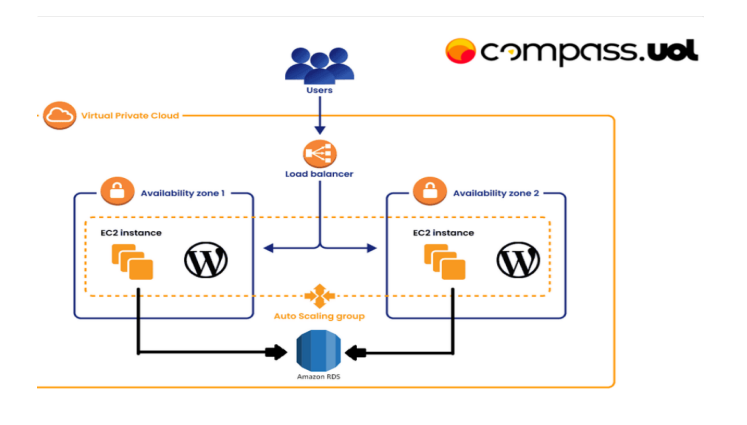
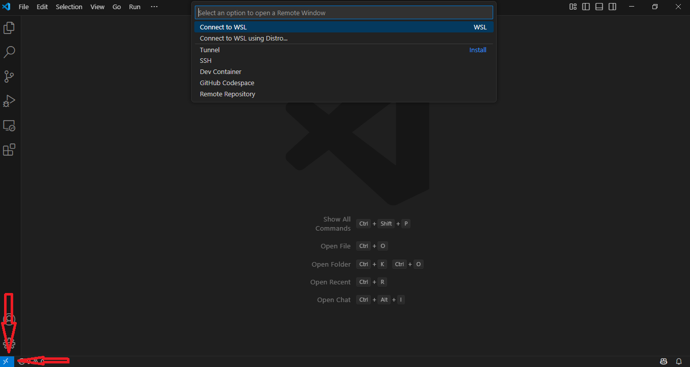
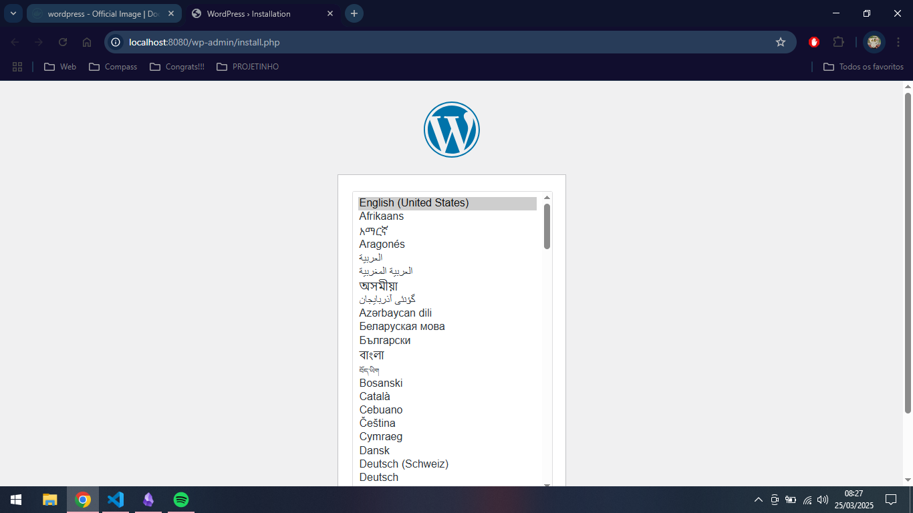
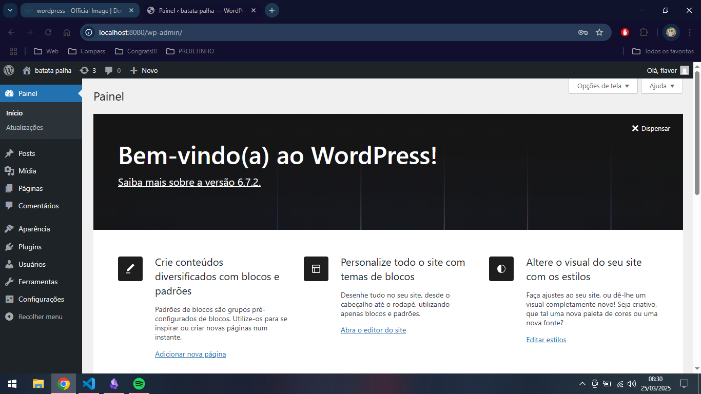

# Projeto:

1. Instalação e configuração do DOCKER ou CONTAINERD no host EC2; SEGUIR DESENHO TOPOLOGIA DISPOSTA. `Ponto adicional para o trabalho utilizar a instalação via script deStart Instance (user_data.sh)`

2. Efetuar Deploy de uma aplicação Wordpress com: container de aplicação RDS database Mysql. 

3. Configuração da utilização do serviço EFS AWS para estáticos do container de aplicação Wordpress .

4. Configuração do serviço de Load Balancer AWS para a aplicação Wordpress.



### Pontos de atenção:

- Não utilizar ip público para saída do serviços WP (Evitem publicar o serviço WP via IP Público) 
- Sugestão para o tráfego de internet sair pelo LB (Load Balancer Classic)
- Pastas públicas e estáticos do wordpress sugestão deutilizar o EFS (Elastic File Sistem)
- Fica a critério de cada integrante usar Dockerfile ou Dockercompose;
- Necessáriodemonstrar a aplicação wordpress funcionando (tela de login) 
- AplicaçãoWordpress precisa estar rodando na porta 80 ou 8080;
- Utilizar repositório git para versionamento; 
- Criar documentação.

## Conclusão:

### Primeira etapa: Criação do ambiente de testes.

1 - Baixe o wsl (Pela loja da Microsoft || Por linha de comando).

```
wsl --install
```


2 - Instale a versão mais atual do ubuntu (Pela loja da Microsoft || Por linha de comando).

```
wsl --install -d Ubuntu-24.04
```

3 - Instale o um editor de código de sua preferência (VScode).

```
https://code.visualstudio.com/download
```

4 - Faça um conexão ao wsl.



```
Assim que você entrar no vscode já com o wsl instalado ele vai te recomendar que baixe uma extensão chamada wsl, após a instalação você podera clicar no simbolo >< no canto inferior esquerdo e após isso é só apertar em "Connect to WSL" e estará dentro da maquina !! 
```

5 - Atualize a maquina.

```
sudo apt update && sudo apt upgrade -y
```

6 - Instale o docker && docker compose.

```
1- sudo apt install -y ca-certificates curl gnupg

2- sudo install -m 0755 -d /etc/apt/keyrings
curl -fsSL https://download.docker.com/linux/ubuntu/gpg | sudo gpg --dearmor -o /etc/apt/keyrings/docker.gpg
sudo chmod a+r /etc/apt/keyrings/docker.gpg

3- echo \
  "deb [arch=$(dpkg --print-architecture) signed-by=/etc/apt/keyrings/docker.gpg] https://download.docker.com/linux/ubuntu \
  $(. /etc/os-release && echo "$VERSION_CODENAME") stable" | \
  sudo tee /etc/apt/sources.list.d/docker.list > /dev/null

4- sudo apt update

5- sudo apt install -y docker-ce docker-ce-cli containerd.io docker-buildx-plugin docker-compose-plugin

6- sudo usermod -aG docker $USER

7- sudo systemctl enable docker
sudo systemctl start docker

----------------------------------------------------------------------------------------

1- Instale as dependências necessárias.
2- Adicione a chave GPG oficial do Docker.
3- Adicione o repositório do Docker ao APT.
4- Atualize novamente.
5- Instale o Docker && o docker compose.
6- Adicione seu usuário ao grupo `docker` (Opcional).
7- Habilite o Docker para iniciar com o sistema (Opcional).
```

### Segunda etapa: Teste de implementação do *Wordpress* localmente.

1-  Criar uma abstração dos volumes e redes (Opcional).

```
----------------------------------------------------------------------------------------

|- NETWORK
|-- NAME 'tunel'

----------------------------------------------------------------------------------------

|- VOLUMES
|-- NAME wordp
|-- NAME dbm

----------------------------------------------------------------------------------------

Projeto: foi definido que o nome da rede será 'tunel' e que será criado dois volumes, um para armazenar os arquivos do site(wordp) e o outro, arquivos referentes ao banco de dados(dbm).
```

2- Criar volumes para arquivos do site e do banco de dados.

```
1- docker volume create wordp

2- docker volume create dbm

3- docker volume ls

----------------------------------------------------------------------------------------

1- Cria um volume para o Wordpress.
2- Cria um volume para o Banco de dados mysql.
3- Listas os volumes.
```


3- Criar uma rede para permitir uma conexão entre o banco e o site.

```
1- docker network create tunel

2- docker network ls

----------------------------------------------------------------------------------------

1- Cria uma rede com o nome 'tunel'.
2- Lista as redes.
```

4- Criar pastas para armazenar arquivos referentes ao projeto.

```
1- mkdir projetinho
2- cd projetinho

----------------------------------------------------------------------------------------

1- Cria uma diretório com o nome 'projetinho'
2- Entra no diretório especificado (Por mais leigo que seja, fazer uma estrutura para um projeto é essencial).
```

5- Checar a documentação  do docker-hub

```
https://hub.docker.com/_/wordpress
```

6- Criar uma abstração do banco de dados (Opcional).

```
|- DB NAME 'projetinho'
|-- DB USER 'cariani'
|-- DB PASSWORD '0311'
```

7- Criar um compose seguindo a documentação acima.

nano `docker-compose.yml`: 
```
services:
  web:
    image: wordpress:php8.1-apache
    restart: always
    ports:
      - 8080:80
    environment:
      WORDPRESS_DB_HOST: db
      WORDPRESS_DB_USER: cariani
      WORDPRESS_DB_PASSWORD: 0311
      WORDPRESS_DB_NAME: projetinho
    volumes:
      - wordp:/var/www/html
    networks:
      - tunel

  db:
    image: mysql:8.0
    restart: always
    environment:
      MYSQL_DATABASE: projetinho
      MYSQL_USER: cariani
      MYSQL_PASSWORD: 0311
      MYSQL_RANDOM_ROOT_PASSWORD: '1'
    volumes:
      - dbm:/var/lib/mysql
    networks:
      - tunel

networks:
  tunel:
    driver: bridge

volumes:
  wordp:
  dbm:

```

8- Executar o compose, e após o teste apagar ele.

```
1- docker compose up -d

2- docker compose down

----------------------------------------------------------------------------------------
 
1- Executa o arquivo 'docker-compose.yml'
2- Exclui os containers gerados(Caso não tenha criado os volumes e a rede antes de executar, o mesmo irá criar as redes serão excluidas más os volumes permanecerão)
```

9- Resultado.


<br>



### Terceira etapa: `AWS` Criação da topologia da rede e seus grupos de segurança.


